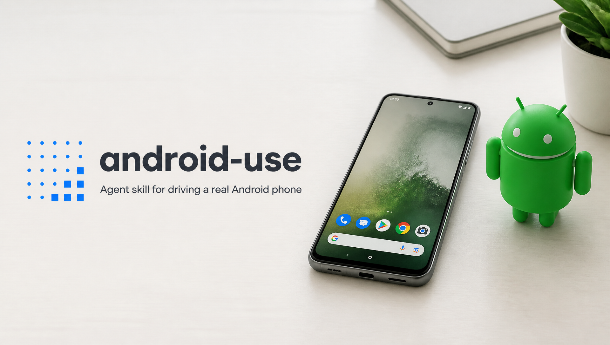

<p align="center">
  
</p>

# android-use

Control an Android phone from any skill-capable AI agent (Claude Code first): plug the
phone in over USB, install this skill, and the agent can see the screen and drive the UI
through adb — semantic UI-tree first, screenshots as fallback, CJK input included,
optional live mirroring so you can watch every tap.

**Status: v0.1 — working.** Field-tested end to end on a real device against Taobao
(search, product research, report generation). See [PLAN.md](PLAN.md) for architecture
and roadmap, [TECH-REVIEW.md](TECH-REVIEW.md) for the technology-selection review and
field-test results.

## Install

```sh
git clone https://github.com/ReScienceLab/android-use.git
cd android-use && ./install.sh          # symlinks into ~/.claude/skills
```

Requires `adb` on PATH (macOS: `brew install android-platform-tools`) and `python3`.
Optional: `scrcpy` for the `mirror` command. On the phone: enable USB debugging
(see `skills/android-use/references/setup.md`).

## What the agent gets

One stdlib-only CLI (`skills/android-use/scripts/cli.py`) behind a ~100-token skill:

| Command | Effect |
|---|---|
| `snapshot [--settle]` | ref-annotated semantic UI tree of the current screen |
| `tap <ref>` / `tap <x> <y>` | tap an element or coordinate (`--long` to long-press) |
| `type "text" [--clear]` | type into the focused field; CJK/emoji via bundled yadb |
| `scroll` / `swipe` / `key` | gestures and keyevents |
| `screenshot [out.png]` | PNG of the screen for visual fallback / report evidence |
| `app <pkg> [--stop]`, `app --list F` | launch (verified) / find packages |
| `mirror [--off]` | live scrcpy window with visible touch indicator |
| `devices`, `selftest` | plumbing |

Design notes: no daemon (adb server is the daemon), no on-device agent to install,
state between calls is one refmap JSON under `~/.cache/android-use`.

## License

Apache-2.0. The bundled `bin/yadb` dex is from [YADB](https://github.com/ysbing/YADB)
(LGPL-3.0) — see [NOTICE](NOTICE).

The banner image includes the Android robot, which is reproduced or modified from work
created and shared by Google and used according to terms described in the
[Creative Commons 3.0 Attribution License](https://creativecommons.org/licenses/by/3.0/).
